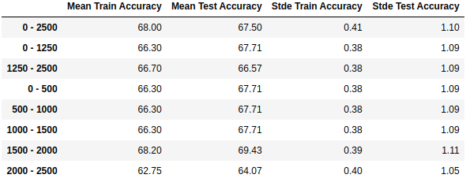

.. Examples of usage

Basic Examples
=================================================
Here we can find some basic examples of using the methods included in the package.

.. note::
    We suggest using the ``.shape`` attribute when running these examples in order to understand the expected
    inputs and outputs.

RMSF Cherry Picked Residues
###########################

We define **cherry picking** as empirically deciding which residues and on which windows we are going to
calculate the RMSF of the ligands. The selection of the residues may come from a combination of plots or from
the experience in the field.

The example below inputs a dictionary of specific residues on specific windows and creates their 2D PCA projection
of their 1st 3 PCs, in order to evaluate their separability.

.. literalinclude:: ../../examples/rmsf_cherry_pick.py

**Output**

.. image:: ../_static/cherry_pick_2D.png
    :width: 700px
    :align: center
    :height: 270px
    :alt: missing cherry pick 2D projections

RMSF Baseline Models
####################

The example below shows how we can evaluate the residue selection using simple and intuitive models
implemented on this package. This example **should not** be used as a model for classifying ligands,
only for evaluating residue selections.

Briefly the flow below is:

1. Read the data
2. Bootstrap the ligands to create a number of training - validation samples
3. For each window and bootstrap samples fit and predict on the training and validation set
4. Create a DataFrame summarizing the results

.. literalinclude:: ../../examples/rmsf_bootstrapped_residue_evaluation.py

**Output** (if ran on Jupyter Notebook, using ``display`` instead of ``print`` at the end):

