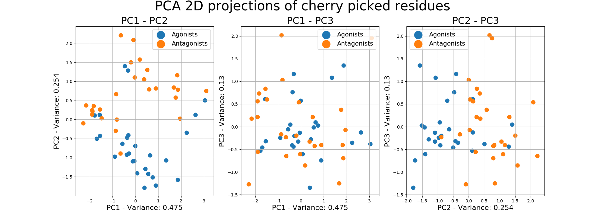

.. Examples of usage

Basic Examples
=================================================
Here we can find some basic examples of using the methods included in the package.

.. note::
    We suggest using the ``.shape`` attribute when running these examples in order to understand the expected
    inputs and outputs.

RMSF Cherry Picked Residues
###########################

We define **cherry picking** as empirically deciding which residues and on which windows we are going to
calculate the RMSF of the ligands. The selection of the residues may come from a combination of plots or from
the experience in the field.

The example below inputs a dictionary of specific residues on specific windows and creates their 2D PCA projection
of their 1st 3 PCs, in order to evaluate their separability.

.. literalinclude:: ../../examples/rmsf_cherry_pick.py

**Output**

