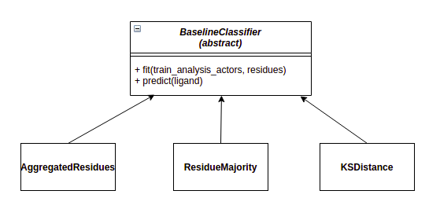

.. RMSF Baseline Models documentation

RMSF Baseline Models
=================================================

On this package we are focusing a lot on the RMSF value as a mean of selecting which residues have the most
separability between the Agonist - Antagonist classes. In order to evaluate our residue selection techniques we
need a way to quantify their separability.

For this reason we created some baseline models which are simple and can be used as any ML model (``fit``, ``predict``)
and calculate values such as accuracy.

In the module we have an abstract base class called ``BaselineClassifier`` which contains some basic helper methods
for reading and preparing the RMSF values. Any subclass must implement the ``fit`` and ``predict`` methods.

We suggest reading  :ref:`this example<rmsf_baseline_models>` to feel familiar with the flow.

.. warning::

    These models should not be used as the final classification models due to their simplicity. Their goal is
    evaluate the residue selection techniques.

The module also includes a method for bootstrapping the dataset of ligands.

.. automodule:: MDSimsEval.rmsf_baseline_models
    :members: