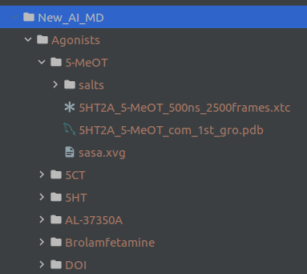

.. Reading data documentation

Reading the simulations
=================================================
This doc page will guide you through preparing your data in the package expected structure and present a function
for reading and storing them.

Directory Structure
###################

Our reader function expects a specific directory structure.

::

    input_directory/
      Agonists/
        Ligand1_/
          trajectory_.xtc
          topology_.pdb
          sasa.xvg *
          salts/ *
        Ligand2_
           .
           .
           .
      Antagonists/
         .
         .
         .

On the above structure everything followed by an underscore ``_`` can have a different name.

``Agonists`` and ``Antagonists`` were the class labels of my use case. Currently, you must follow the same names as
class labels. To be fixed so as class label is also a variable.

.. note::
   ``sasa.xvg`` and ``salts/`` are explained in :ref:`reading_salt_sasa`.

As an example this was my actual input directory named ``New_AI_MD``:

|
|

Reading Function
#################

.. automodule:: MDSimsEval.utils
    :members:

.. _reading_salt_sasa:

SASA and Salt Bridges
######################

These two features have a different way of being calculated outside of this package.

Concerning **SASA** we must first create a ``sasa.xvg`` file for each simulation and keep it next to the topology and the
trajectory. The `GROMACS <http://manual.gromacs.org/documentation/5.1/onlinehelp/gmx-sasa.html>`_ command is::

 gmx sasa -f trajecotry.xtc -s topology.pdb -o sasa.xvg

Concerning the **salt bridges** you must use a `VMD <https://www.ks.uiuc.edu/Research/vmd/plugins/saltbr/>`_ plugin and
copy the whole outputted directory named ``salts/`` next to the trajectory files.

.. note:: Currently no analysis functions uses salt bridges in this package.

.. todo::

   Create a script to automate the above tedious calculations