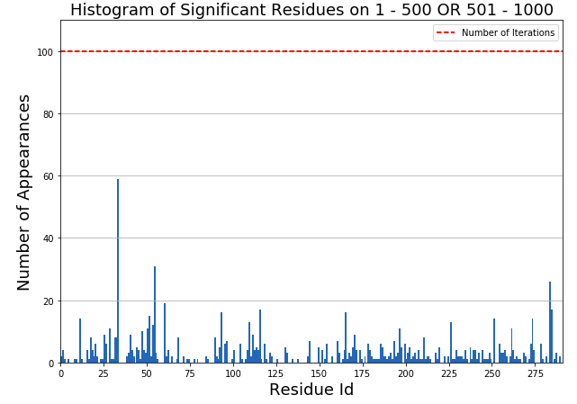

.. RMSF Analysis documentation

RMSF Analysis
=================================================

RMSF is a measure of the deviation of the position of a particle i with respect to a reference position **over time**.

**Difference between RMSD and RMSF**: The latter is averaged over time, giving a value for each particle i. For the
RMSD the average is taken over the particles, giving time specific values. So **RMSD is time specific** and **RMSF
is atom specific** `(ref) <http://www.drugdesign.gr/uploads/7/6/0/2/7602318/lecture_mdanalysis.pdf>`_.

This module aims on finding which are **the most differentiating residues of the two classes based on their RMSF**.
To achieve that I followed two paths:

* :ref:`top_high_rmsf_analysis`, which is a more simplistic and prone to overfitting approach
* :ref:`bootstrapped_rmsf_analysis` (*recommended*), which is more complex and time consuming but more robust to the results it gives

.. _top_high_rmsf_analysis:

Top and High RMSF Analysis
##########################

We define as **High-k**, the k residues that had the highest RMSF on their respective class. This creates two
lists of residues, one for each class.

We define as **Top-k**, the k residues that had the biggest ``abs(high_k_class1 - high_k_class2)``.

.. automodule:: MDSimsEval.rmsf_analysis
    :members:
    :exclude-members: return_top_k

.. _bootstrapped_rmsf_analysis:

Bootstrapped RMSF Analysis
##########################

Bootstrapped RMSF analysis aims on finding the most significant residues which their RMSF helps us differentiate
our two classes. It differs from the *Top and High Analysis* above since it uses good data science practises to **avoid
overfitting and providing with an evaluation of how general enough are our results**.

More on the method used to achieve this can be found on ``bootstrapped_residue_analysis`` function below.

Example:
        ::

            from MDSimsEval.utils import create_analysis_actor_dict

            from MDSimsEval.rmsf_bootstrapped_analysis import bootstrapped_residue_analysis
            from MDSimsEval.rmsf_bootstrapped_analysis import sensitivity_calc

            analysis_actors_dict = create_analysis_actor_dict('path_to_data_directory/')

            # Find the most significant residues per iteration
            significant_res_per_iter = bootstrapped_residue_analysis(analysis_actors_dict, windows=[[0, 500], [500, 1000]],
                                       stat_test=stats.ks_2samp, threshold=0.05, input_size=12, replacement_size=8,
                                       iterations=100, replacements=1)

            # Calculate the sensitivity of the residues that are significant on at least one iteration
            sensitivity = sensitivity_calc(significant_res_per_iter)

            # Create a histogram of the most significant residues
            fig = plt.figure(figsize=(10,7))
            ax = fig.add_subplot(111)

            # Flatten the sets of significant residue to a single list
            flat_res = [residue for iteration_residues in res for residue in iteration_residues]

            plt.hist(flat_res, bins=np.arange(292))    # Hardcoded number of residues

            plt.xlabel("Residue Id", fontsize=18)
            plt.ylabel("Number of Appearances", fontsize=18)
            plt.title("Histogram of Significant Residues on 1 - 500 OR 501 - 1000", fontsize=18)
            plt.xlim(0, 291)
            plt.xticks(np.arange(0, 292, 25))
            plt.ylim(0, 110)
            ax.yaxis.grid()

            plt.hlines(y=100, xmin=0, xmax=291, color='red', linestyles='dashed', label="Number of Iterations")

            plt.legend()

            plt.show()

**Output:**

        Histogram of significant residues from bootstrapped method

.. automodule:: MDSimsEval.rmsf_bootstrapped_analysis
    :members: